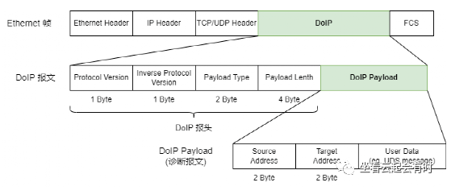

## 主旨

本文用于记录在开发DOIP服务端过程收集的DOIP相关信息。

### DOIP简介

DoIP: Diagnostic communication over Internet Protocol
即基于因特网协议的诊断通信协议，对应的ISO标准号为13400.

### DoIP报文详情

PS:从报文结构看，DoIP协议是建立在TCP/UDP协议之上，其内部可承载UDS诊断报文。

### DoIP节点的行为

端口号

UDP_DISCOVER： 13400

TCP_DATA: 13400

DoIP服务端

- 车内网关、ECU做服务端

- Discover(车辆发现)，包含两个部分
  
  - 被激活后，主动向外广播车辆声明，目标端口UDP_DISCOVER,在500ms内发送三次。
  
  - 监听UDP_DISCOVER上的报文(13400/UDP)，处理外部的请求。外部的客户端可主动向该端口发送获取车辆信息的报文。

- TCP_DATA通信部分
  
  - 监听TCP_DATA上的报文（13400/TCP）,处理外部连接。外部通过车辆发现后得到车辆信息，主动通过TCP来连接车辆。
  
  - 路由激活，DOIP定义的报文。外部设备通过该报文，获取车辆的逻辑地址。

DoIP客户端

## UDS相关

0x22服务：

[汽车UDS诊断之通过标识符读取数据服务（0x22）深度剖析_uds 0x22-CSDN博客](http://t.csdnimg.cn/AW4Vu)

DID: （Diagnostic Identifier）是一种标识符，用于唯一标识诊断服务或功能。这个值是由车辆制造商自己定义的。

22 DID#1(MSB) DID#1  // 这种DID的取值范围短一点 0x00 ~0xFF

22 DID#1(MSB) DID#1 DID#2 DID#2 // 这种DID的取值范围长一点 0x00 ~0xFFFF

例如读取车辆的VIN码

UDS请求报文：22 F1 90

UDS响应报文：62 F1 90 30 31 32 33 34 35 36 37 38 39 30 31 32 33 34 35 36 (17字节的ASCII码VIN “01234567890123456”)

参考文献

- [DoIP概述_AP AUTOSAR-CSDN专栏](https://download.csdn.net/blog/column/10225195/132345937)
- http://t.csdnimg.cn/ivPQp
